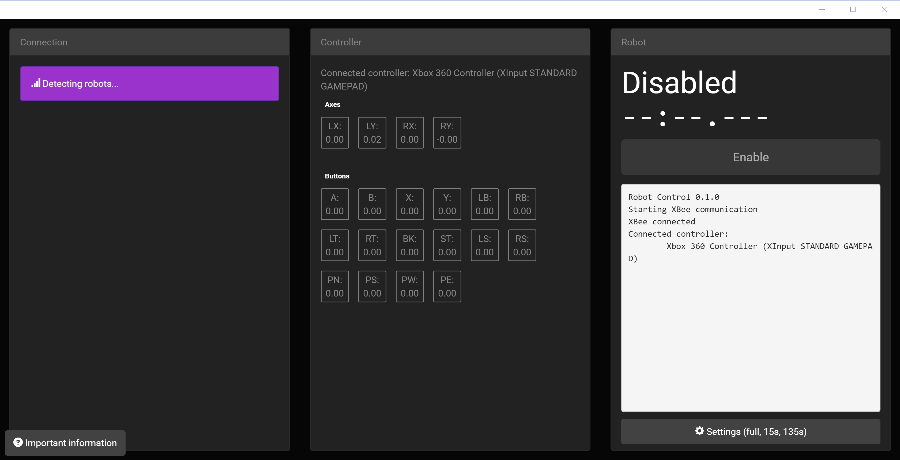

# Arduino Robot Control #

This project enables remote control of Arduino-based robots using standard gamepads and wireless XBee (series 1) modules. Chromebooks are supported as remote controllers. It can run a full FRC-style robot match with autonomous and teleoperated modes. It's designed for use with the Logitech F310 but it would likely work with other gamepads with a few modifications. Inspired by the FRC driver station.



There are two parts:
- A chrome app for remote control
- An Arduino library for recieving remote commands

## What you will need ##
- 2x XBee series 1 (series 2 will probably work but it's untested)
- USB adapter for XBee
- Logitech gamepad
- Arduino XBee shield
- Arduino (duh)

## Getting started ##

Download the crx and Arduino library from the releases tab above or see the building section to build it yourself.

Extract the Arduino library zip into your Arduino libraries folder, or copy and paste the library code to the top of your program manually for single-file editors like Codebender.

To set up the XBees, you need Digi's XCTU software. I left channel and PAN ID default but you can change those.
Robot XBees
- baud: 57600 (you can try 115200 but it didn't work for me)
- API enable: enabled with PPP (enabled with escapes)
- 16 bit source address: choose a unique address for each XBee
- Node Identifier: A descriptive name. This will be displayed in the Chrome app to identify your robot

Controller XBees
- baud: 57600
- API enable: enabled with PPP
- 16 bit source address: a unique address

## Chrome app ##

The Chrome app reads gamepad values and sends them wirelessly to the Arduino using the html5 gamepad API and the chrome.serial API. It functions on any device that runs Chrome, including Chromebooks. To install the app, drag it onto chrome://extensions. The app isn't on the webstore yet.

Note: The frame for reading gamepad values is intentional. It's a workaround for a bug in current Chrome (58).

## Arduino library ##

The Arduino library reads commands sent by the Chrome app and exposes them with an API. Simply `#include <RobotControl.h>` at the top of your file.

Note: Because of problems in `SoftwareSerial`, the library uses hardware `Serial` for XBee communication. You can modify it to use Serial1 on boards with multiple serial ports, but on a board like the Uno you will need to make sure USB is not connected while using the XBee to avoid serial line contention.

### Changes in Arduino program structure ###

Instead of the standard `setup()` and `loop()` functions, you need to define `setup()` `loopAuto()` and `loopTeleop()`. `loopAuto` is called during auto mode and `loopTeleop` during teleop.

Note: You're free to delay as long as needed in the loop functions. The library uses interrupts to make sure communication still occurs with the controller. However, if a loop function takes too long when the robot is disabled or transitions from auto to teleop, the watchdog timer will be enabled and the avr will reset. Some Arduino bootloaders I've seen really don't like the watchdog timer and tend to lock up when it triggers a reset, so make sure your board is running the official bootloader (eg optiboot).

### `RobotControl.begin()` ###
This sets things up and opens the serial port. If you don't call it in `setup()`, it will be called automatically.

### `RobotControl.getAxis(ControllerAxis)` ###
Returns a `float` from `-1` to `1` for the specified axis.

### `RobotControl.getButton(ControllerButton)` ###
Returns a `float` from `0` to `1`. Most buttons will be binary, but trigger buttons give analog values. The html5 gamepad api treats triggers and binary buttons the same way, and I didn't bother to separate them.

### `RobotControl.log(String)` ###
Logs to the Chrome app using an Arduino String. Can only be called once per data transmission (ideally 30 times per second) because proper locking would harm performance.

### Enums ###

`getAxis` and `getButton` take these values.

```
enum ControllerAxis {
  LEFT_X = 0,
  LEFT_Y = 1,
  RIGHT_X = 2,
  RIGHT_Y = 3
};

enum ControllerButton {
  A = 4,
  B = 5,
  X = 6,
  Y = 7,
  BUMPER_LEFT = 8,
  BUMPER_RIGHT = 9,
  TRIGGER_LEFT = 10,
  TRIGGER_RIGHT = 11,
  BACK = 12,
  START = 13,
  STICK_LEFT = 14,
  STICK_RIGHT = 15,
  HAT_NORTH = 16,
  HAT_SOUTH = 17,
  HAT_WEST = 18,
  HAT_EAST = 19,
  LOGITECH = 20
};
```

## Troubleshooting ##
Make sure the XBee is connected to the hardware serial port of the Arduino. Make sure the Arduino has the latest official bootloader (eg optiboot). Try pressing the reset button on the Arduino or on the XBee USB adapter.

## Building ##

Clone the repo and `npm install`. Then `npm run build`. Load `dist/` as an unpacked Chrome app.