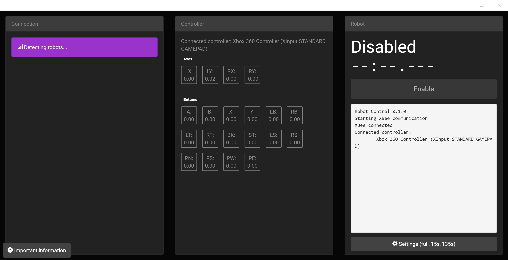

# Documentation #

## What you will need ##
- 2x XBee series 1 (series 2 will probably work but it's untested)
- USB adapter for XBee
- Logitech gamepad
- Arduino XBee shield
- Arduino (duh)

## Getting started ##

Download the crx and Arduino library from the [releases page](https://github.com/erikuhlmann/Arduino-Robot-Control/releases)

To install the crx in Chrome, open chrome://extensions and drag the crx onto it.

- *Arduino IDE*: Extract the library zip file into your Arduino libraries folder (eg `C:\Users\You\Documents\Arduino\libraries`). Then make sure you also install the XBee library to the IDE.
- *Codebender*: Use the single-file version and copy+paste it into codebender.

### Example code ###

In the Arduino IDE, you can use `#include <RobotControl.h>` to include the library. In codebender, add your code at the bottom.

```c++
#include <RobotControl.h>

void setup() {
  RobotControl.begin();
  
  pinMode(BUILTIN_LED, OUTPUT);
}

void loopAuto() {
  digitalWrite(BUILTIN_LED, HIGH);
  delay(1000);
  digitalWrite(BUILTIN_LED, LOW);
  delay(1000);
}

void loopTeleop() {
  float buttonPressed = RobotControl.getButton(A);
  if (buttonPressed) {
    digitalWrite(BUILTIN_LED, HIGH);
  } else {
    digitalWrite(BUILTIN_LED, LOW);
  }
}
```

In codebender this would look like

```c++
/*
 * single file version of the library at the top here
 * .....
 * etc
 */

void setup() {
  RobotControl.begin();
  
  pinMode(BUILTIN_LED, OUTPUT);
}

void loopAuto() {
  digitalWrite(BUILTIN_LED, HIGH);
  delay(1000);
  digitalWrite(BUILTIN_LED, LOW);
  delay(1000);
}

void loopTeleop() {
  float buttonPressed = RobotControl.getButton(A);
  if (buttonPressed) {
    digitalWrite(BUILTIN_LED, HIGH);
  } else {
    digitalWrite(BUILTIN_LED, LOW);
  }
}
```

Instead of the standard `setup()` and `loop()` functions, you need to define `setup()` `loopAuto()` and `loopTeleop()`. `loopAuto` is called during auto mode and `loopTeleop` during teleop.

Note: You're free to delay as long as needed in the loop functions. The library uses interrupts to make sure communication still occurs with the controller. However, if a loop function takes too long when the robot is disabled or transitions from auto to teleop, the watchdog timer will be enabled and the avr will reset. Some Arduino bootloaders I've seen really don't like the watchdog timer and tend to lock up when it triggers a reset, so make sure your board is running the official bootloader (eg optiboot - see troubleshooting). If you run a "full match" and the connection drops ("Waiting for robot to respond") after it switches from auto to teleop, you need to update the bootloader.

## Chrome app ##

The Chrome app reads gamepad values and sends them wirelessly to the Arduino using the html5 gamepad API and the chrome.serial API. It functions on any device that runs Chrome, including Chromebooks. To install the app, drag it onto chrome://extensions. The app isn't on the webstore yet.

Note: The frame for reading gamepad values is intentional. It's a workaround for a bug in current Chrome (58).

### Using the app and controlling your robot ###

If using a single-serial board like the Uno make sure the XBee is set to use the serial port and USB is disconnected.



On the left is the XBee connection section. When the XBee detects your robot, you can select it to connect. It sometimes takes a few seconds to begin communication so be patient with the "waiting for robot to respond." If the connection drops see the troubleshooting steps.

In the middle is the controller section. It displays all controller axis and button values (red = negative, blue = positive).

On the right is the enable button and log. Click enable to enable your robot (in auto or teleop). In the middle is a log, which robot code can display to (with caveats - see API below). There's also a settings button which configures whether it should run auto then teleop, or just auto, or just teleop, and the time given for each period. You can also use the standard FRC shortcuts: \[\]\\ (brackets and backslash all at the same time) to enable, ENTER or SPACE to disable.

## Arduino library/API ##

The Arduino library reads commands sent by the Chrome app and exposes them with an API.

Note: Because of problems in `SoftwareSerial`, the library uses hardware `Serial` for XBee communication. You can modify it to use Serial1 on boards with multiple serial ports, but on a board like the Uno you will need to make sure USB is not connected while using the XBee to avoid serial line contention. Make sure to disconnect the XBee when uploading code.

### `RobotControl.begin()` ###
This sets things up and opens the serial port. If you don't call it in `setup()`, it will be called automatically.

### `RobotControl.getAxis(ControllerAxis)` ###
Returns a `float` from `-1` to `1` for the specified axis.

### `RobotControl.getButton(ControllerButton)` ###
Returns a `float` from `0` to `1`. Most buttons will be binary, but trigger buttons give analog values. The html5 gamepad api treats triggers and binary buttons the same way, and I didn't bother to separate them.

### `RobotControl.log(String)` ###
Logs to the Chrome app using an Arduino String. Can only be called once per data transmission (ideally 30 times per second) because proper locking would harm performance.

### Enums ###

`getAxis` and `getButton` take these values.

```c++
enum ControllerAxis {
  LEFT_X = 0,
  LEFT_Y = 1,
  RIGHT_X = 2,
  RIGHT_Y = 3
};

enum ControllerButton {
  A = 4,
  B = 5,
  X = 6,
  Y = 7,
  BUMPER_LEFT = 8,
  BUMPER_RIGHT = 9,
  TRIGGER_LEFT = 10,
  TRIGGER_RIGHT = 11,
  BACK = 12,
  START = 13,
  STICK_LEFT = 14,
  STICK_RIGHT = 15,
  HAT_NORTH = 16,
  HAT_SOUTH = 17,
  HAT_WEST = 18,
  HAT_EAST = 19,
  LOGITECH = 20
};
```

## Troubleshooting ##

- Make sure the XBee is connected to the hardware serial port of the Arduino.
- Make sure the Arduino has the latest official bootloader (eg optiboot). Unoffical boards such as RedBoard can ship with bootloaders that really don't like the watchdog timer and lock up if it's used. Dump the flash with avrdude and make sure the code in the end section is about 512 bytes long (the size of optiboot). If not, you can use a [second Arduino to update the bootloader](https://www.arduino.cc/en/Tutorial/ArduinoISP).
- Try pressing the reset button on the Arduino or on the XBee USB adapter.
- Try restarting the Chrome app.

## Setting up the XBees ##

To set up the XBees, you need [Digi's XCTU software](https://www.digi.com/products/xbee-rf-solutions/xctu-software/xctu). It's mostly self-explanatory and I'm sure docs exist. Refer to the [XBee datasheet](https://www.sparkfun.com/datasheets/Wireless/Zigbee/XBee-Datasheet.pdf) for settings codes.
Robot XBees
- baud: 57600 (you can try 115200 but it didn't work for me)
- API enable: enabled with PPP (enabled with escapes)
- 16 bit source address: choose a unique address for each XBee
- Node Identifier: A descriptive name. This will be displayed in the Chrome app to identify your robot

Controller XBees
- baud: 57600
- API enable: enabled with PPP
- 16 bit source address: a unique address

I left channel and PAN ID default but you can change those.